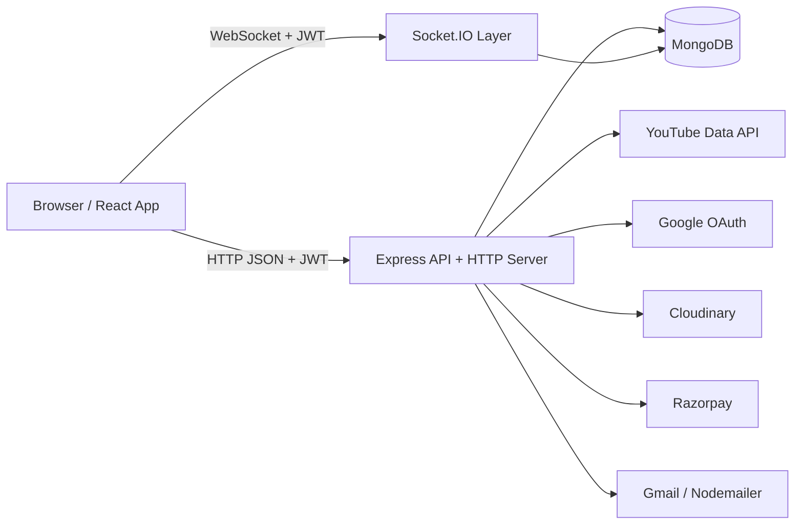

# PrepTube

PrepTube turns a YouTube playlist into a shared study room. A learner can import a playlist, invite collaborators, track progress, keep private notes per video, build streaks, chat in real time, and upgrade the room owner to unlock larger groups.

Status: pre-launch MVP

## What The App Does

PrepTube currently supports:

- Google OAuth sign-in
- Email/password sign-up and login
- Password reset by email
- Profile editing with uploaded or generated avatars
- YouTube playlist import through the YouTube Data API
- One collaborative room per imported YouTube playlist
- Private and public playlist visibility
- Topic tagging for Explore discovery
- Invite-link joining through persistent tokens
- Public Explore feed with topic filters
- Video completion tracking per user
- Private per-video notes per user
- Per-playlist streak tracking based on study time
- Real-time room chat with text, image, and voice messages
- Premium upgrade flow with Razorpay
- Owner-managed collaborators, visibility, and invite regeneration
- Account deletion with cleanup of owned content

## Product Rules

- Each imported YouTube playlist maps to a single PrepTube room. The backend prevents duplicate imports for the same YouTube `playlistId`.
- Free rooms allow up to 6 total people including the owner, which means up to 5 collaborators.
- If the owner has an active premium plan, new joins are not blocked by the free member limit.
- If premium expires, existing members keep access; the join limit applies to future joins.
- Public playlists appear in Explore, but the workspace itself still requires joining the room first.
- Video notes are private to the author even inside a shared playlist.
- Streaks are tracked per user, per playlist, using the `Asia/Kolkata` timezone.
- A streak day counts when the user logs at least 30 minutes in that playlist on that date.

## Tech Stack

### Frontend

- React 19
- Vite
- React Router
- Tailwind CSS 4
- Axios
- Socket.IO client
- Browser `MediaRecorder` for voice messages
- `browser-image-compression` for image uploads
- Razorpay Checkout script

### Backend

- Node.js
- Express 5
- MongoDB
- Mongoose
- Passport Google OAuth 2.0
- JWT authentication
- Socket.IO
- Razorpay SDK
- Nodemailer
- Axios
- Cloudinary upload API

## High-Level Architecture



## Runtime Structure

### Frontend runtime

- `BrowserRouter` defines all app routes.
- Authentication state is stored in `localStorage` as `token` and `user`.
- Protected screens redirect unauthenticated users to `/login?redirect=...`.
- The workspace page opens a Socket.IO connection after the playlist and initial chat history load.
- Razorpay checkout is loaded from the script tag in `frontend/index.html`.

### Backend runtime

- `backend/server.js` boots Express, connects MongoDB, configures CORS/compression/JSON parsing, and mounts routes.
- The HTTP server is shared with Socket.IO.
- `protect` middleware verifies JWTs and also normalizes user plan/avatar/username state.
- `planMiddleware` blocks joins when a free room is already full.
- Controllers own business logic.
- Mongoose models store users, playlists, and chat messages.

## Core Data Flow

### 1. Authentication flow

#### Google OAuth

```text
User clicks Continue with Google
-> browser navigates to /api/auth/google?redirect=...
-> Passport starts Google OAuth
-> backend finds or creates user
-> backend signs JWT
-> backend redirects to /auth/callback?token=...&redirect=...
-> frontend fetches /api/users/me with that token
-> frontend stores token + user in localStorage
-> frontend sends user to the requested route
```

#### Email/password auth

```text
User registers or logs in
-> frontend POSTs /api/users/register or /api/users/login
-> backend validates credentials
-> backend returns serialized user + JWT
-> frontend stores auth in localStorage
-> protected screens use Bearer token on later requests
```

Important auth notes:

- Manual registration only allows Gmail or Google Mail addresses.
- Google accounts can be linked to an existing email user.
- Missing usernames and avatars are auto-generated on login/auth middleware.

### 2. Playlist import flow

```text
User pastes a YouTube playlist URL on /courses
-> frontend POST /api/playlists/create
-> backend extracts the YouTube list id
-> backend fetches playlist metadata from YouTube
-> backend fetches playlist items, paginated
-> backend fetches video durations in batches
-> backend stores normalized videos in MongoDB
-> backend creates a persistent invite token
-> frontend refreshes the course library
```

Imported playlist documents store:

- room ownership and collaborators
- visibility and topics
- normalized video metadata
- per-user progress
- per-user private notes
- invite token

### 3. Explore and public visibility flow

```text
Owner edits topics and makes playlist public
-> frontend PATCH /api/playlists/:playlistId/visibility
-> backend requires owner access
-> backend normalizes topics
-> backend rejects public visibility if no topics are selected
-> playlist appears in /api/playlists/explore
-> frontend Explore screen filters public rooms by topics
```

### 4. Invite and join flow

```text
Owner generates invite link
-> frontend POST /api/playlists/:playlistId/invite
-> backend returns /join/:token link

User joins through token, invite URL, or Explore
-> frontend POST /api/playlists/join
-> middleware resolves invite token or public playlist id
-> middleware enforces member limit unless owner has active premium
-> backend adds user to members[]
-> frontend redirects to /video/:playlistId
```

### 5. Workspace, progress, notes, and streak flow

```text
User opens /video/:id
-> frontend GET /api/playlists/:playlistId/details
-> backend returns videos, access info, stats, invite token for owner, and requester's progress
-> frontend renders the shared workspace

User marks a video complete
-> frontend POST /api/playlists/mark or /unmark
-> backend updates progress[user].completedVideos
-> frontend reloads playlist details

User writes a note
-> frontend PUT /api/playlists/:playlistId/videos/:videoId/note
-> backend stores or clears the note inside playlist.videoNotes
-> note is returned only as part of the current user's video state

User stays active in workspace
-> frontend accumulates watched time locally
-> frontend POST /api/playlists/:playlistId/time every 5 minutes and on unload/visibility change
-> backend merges time into progress[user].dailyMinutes
-> backend recalculates currentStreak and longestStreak
```

### 6. Chat and media flow

```text
Workspace loads
-> frontend GET /api/playlists/:playlistId/chats for latest history
-> frontend opens Socket.IO with JWT in handshake auth
-> client emits joinRoom
-> socket server verifies playlist access

Text chat
-> client emits chatMessage
-> socket server validates access and payload
-> chat is stored in ChatMessage collection
-> server emits newMessage to the playlist room

Image or voice chat
-> frontend uploads file to /api/playlists/:playlistId/chat/upload
-> backend uploads media to Cloudinary
-> backend returns mediaUrl + messageType
-> frontend emits chatMessage with that mediaUrl
-> socket server persists and broadcasts message
```

### 7. Payment and plan flow

```text
User clicks Subscribe on /pricing
-> frontend POST /api/payment/create-order
-> backend creates Razorpay order
-> frontend opens Razorpay Checkout
-> Razorpay returns payment response to frontend
-> frontend POST /api/payment/verify
-> backend verifies HMAC signature
-> backend upgrades user to premium and extends premiumExpiresAt
-> frontend stores updated user
-> success page reads payment details from navigation state or sessionStorage
```

Important payment note:

- Payment records are currently stored in an in-memory `Map` in `paymentController.js`, not in MongoDB. That means order verification state is not durable across server restarts or horizontal scaling.

### 8. Password reset and account deletion flow

```text
Forgot password
-> frontend POST /api/auth/forgot-password
-> backend creates a hashed reset token with 15-minute expiry
-> backend emails reset link using CLIENT_URL

Reset password
-> frontend POST /api/auth/reset-password/:token
-> backend verifies hashed token and expiry
-> backend replaces password and clears token fields

Delete account
-> frontend DELETE /api/users/me
-> backend deletes owned playlists and their chats
-> backend removes membership, progress, notes, and direct chat records
-> backend deletes the user document
```

## Data Model

### `User`

Stored in `backend/models/User.js`.

Key fields:

- `name`
- `email`
- `username`
- `password`
- `googleId`
- `avatar`
- `role`
- `isPremium`
- `plan`
- `premiumExpiresAt`
- `passwordResetToken`
- `passwordResetExpires`

Behavioral notes:

- Passwords are hashed with `bcryptjs` on save.
- Premium status is treated as active only if `premiumExpiresAt` is in the future.
- Avatar defaults to DiceBear if not supplied.

### `Playlist`

Stored in `backend/models/Playlist.js`.

Key fields:

- `playlistId`
- `title`
- `owner`
- `members[]`
- `isPublic`
- `topics[]`
- `inviteToken`
- `videos[]`
- `videoNotes[]`
- `progress[]`
- `createdAt`
- `updatedAt`

Embedded structures:

- `videos[]`
  - `videoId`
  - `title`
  - `thumbnail`
  - `duration`
  - `durationSeconds`
- `videoNotes[]`
  - `videoId`
  - `user`
  - `content`
  - `updatedAt`
- `progress[]`
  - `user`
  - `completedVideos[]`
  - `currentStreak`
  - `longestStreak`
  - `lastStreakDate`
  - `dailyMinutes[]`

Behavioral notes:

- Progress and notes are embedded inside the playlist document, not stored as separate collections.
- Playlist state is normalized before access in several controller paths to dedupe members, progress rows, notes, and topics.
- There is one unique playlist document per YouTube playlist id.

### `ChatMessage`

Stored in `backend/models/ChatMessage.js`.

Key fields:

- `playlist`
- `sender`
- `message`
- `messageType`
- `mediaUrl`
- `createdAt`
- `updatedAt`

Behavioral notes:

- Chat history is persisted separately from the playlist document.
- REST history fetch currently returns the latest 50 messages.

## API Surface

### Frontend routes

| Route | Purpose |
| --- | --- |
| `/` | Marketing landing page |
| `/courses` | Authenticated playlist library and import/join entry |
| `/explore` | Public playlist discovery |
| `/pricing` | Free vs premium plan page |
| `/success` | Payment success receipt |
| `/join/:token` | Invite-link join handler |
| `/login` | Email login + Google entry |
| `/register` | Email signup + Google entry |
| `/auth/callback` | OAuth token bootstrap page |
| `/video/:id` | Shared playlist workspace |
| `/profile` | Profile and account settings |
| `/forgot-password` | Reset request form |
| `/reset-password/:token` | Password reset form |

### Backend routes

#### Auth: `/api/auth`

| Method | Path | Purpose |
| --- | --- | --- |
| `GET` | `/google` | Start Google OAuth |
| `GET` | `/google/callback` | Complete Google OAuth |
| `GET` | `/protected` | Example protected endpoint |
| `POST` | `/forgot-password` | Send reset email |
| `POST` | `/reset-password/:token` | Complete password reset |

#### Users: `/api/users`

| Method | Path | Purpose |
| --- | --- | --- |
| `POST` | `/register` | Email signup |
| `POST` | `/login` | Email login |
| `GET` | `/me` | Get current user |
| `PATCH` | `/profile` | Update username/avatar |
| `DELETE` | `/me` | Delete account |

#### Playlists: `/api/playlists`

| Method | Path | Purpose |
| --- | --- | --- |
| `GET` | `/explore` | Public playlists + topic options |
| `POST` | `/create` | Import YouTube playlist |
| `GET` | `/my-playlists` | Rooms owned by or joined by the user |
| `POST` | `/mark` | Mark video complete |
| `POST` | `/unmark` | Unmark video |
| `POST` | `/join` | Join by invite token or public playlist id |
| `GET` | `/:playlistId/details` | Workspace payload |
| `PUT` | `/:playlistId/videos/:videoId/note` | Save or clear private note |
| `GET` | `/:playlistId/chats` | Recent chat history |
| `POST` | `/:playlistId/invite` | Generate or regenerate invite token |
| `POST` | `/:playlistId/leave` | Leave room |
| `DELETE` | `/:playlistId/members/:userId` | Remove member |
| `PATCH` | `/:playlistId/visibility` | Update visibility and topics |
| `POST` | `/:playlistId/time` | Log active study time |
| `POST` | `/:playlistId/chat/upload` | Upload image or voice media |
| `DELETE` | `/:playlistId` | Delete playlist |

#### Payments: `/api/payment`

| Method | Path | Purpose |
| --- | --- | --- |
| `POST` | `/create-order` | Create Razorpay order |
| `POST` | `/verify` | Verify payment and activate premium |

## Project Structure

```text
PrepTube/
├─ backend/
│  ├─ config/
│  │  ├─ db.js
│  │  └─ passport.js
│  ├─ controllers/
│  │  ├─ paymentController.js
│  │  ├─ playlistController.js
│  │  └─ userController.js
│  ├─ middleware/
│  │  ├─ authMiddleware.js
│  │  └─ planMiddleware.js
│  ├─ models/
│  │  ├─ ChatMessage.js
│  │  ├─ Playlist.js
│  │  └─ User.js
│  ├─ routes/
│  │  ├─ authRoutes.js
│  │  ├─ paymentRoutes.js
│  │  ├─ playlistRoutes.js
│  │  └─ userRoutes.js
│  ├─ socket/
│  │  └─ index.js
│  ├─ utils/
│  │  ├─ emailService.js
│  │  ├─ playlistAccess.js
│  │  ├─ playlistTopics.js
│  │  └─ userIdentity.js
│  ├─ package.json
│  └─ server.js
├─ frontend/
│  ├─ src/
│  │  ├─ components/
│  │  │  ├─ ChatMessage.jsx
│  │  │  ├─ ForgotPasswordPage.jsx
│  │  │  ├─ Loader.jsx
│  │  │  ├─ Navbar.jsx
│  │  │  ├─ ResetPasswordPage.jsx
│  │  │  ├─ StreakBadge.jsx
│  │  │  └─ UpgradePromptBanner.jsx
│  │  ├─ pages/
│  │  │  ├─ AuthCallback.jsx
│  │  │  ├─ CoursesPage.jsx
│  │  │  ├─ ExplorePage.jsx
│  │  │  ├─ JoinPage.jsx
│  │  │  ├─ LandingPage.jsx
│  │  │  ├─ LoginPage.jsx
│  │  │  ├─ PricingPage.jsx
│  │  │  ├─ ProfilePage.jsx
│  │  │  ├─ RegisterPage.jsx
│  │  │  ├─ SuccessPage.jsx
│  │  │  ├─ VideoPage.jsx
│  │  │  └─ Icons.jsx
│  │  ├─ utils/
│  │  │  ├─ auth.js
│  │  │  ├─ avatarUpload.js
│  │  │  ├─ meta.js
│  │  │  ├─ payment.js
│  │  │  └─ playlistTopics.js
│  │  ├─ App.jsx
│  │  ├─ main.jsx
│  │  ├─ App.css
│  │  └─ index.css
│  ├─ index.html
│  ├─ package.json
│  ├─ tailwind.config.js
│  ├─ vite.config.js
│  └─ vercel.json
├─ index.html
└─ README.md
```

## How The Frontend Is Organized

### Routing

- `frontend/src/App.jsx` lazy-loads the major pages.
- Route-level pages own data fetching and orchestration.
- Shared UI elements such as navbar, chat message rendering, and streak badge live under `components/`.

### Frontend page responsibilities

- `LandingPage.jsx`
  - product marketing and positioning
- `CoursesPage.jsx`
  - library view
  - playlist import
  - join by token or link
  - delete owned room
- `ExplorePage.jsx`
  - public feed
  - topic filtering
  - public room join
- `VideoPage.jsx`
  - workspace shell
  - selected video state
  - completion toggles
  - private notes
  - study-time tracking
  - live chat
  - invite management
  - visibility/topic management
  - member management
- `PricingPage.jsx`
  - plan comparison and checkout launch
- `SuccessPage.jsx`
  - payment receipt view
- `ProfilePage.jsx`
  - profile editing
  - avatar processing
  - logout
  - account deletion
- `AuthCallback.jsx`
  - OAuth bootstrap

### Frontend utilities

- `auth.js`
  - token storage
  - user storage
  - auth headers
  - redirect helpers
- `payment.js`
  - create order
  - open Razorpay
  - verify payment
  - cache latest payment in `sessionStorage`
- `avatarUpload.js`
  - client-side image resize and conversion for profile photos
- `playlistTopics.js`
  - topic normalization and UI helpers

## How The Backend Is Organized

### Server composition

- `server.js`
  - loads env vars
  - connects MongoDB
  - creates Express app + HTTP server
  - attaches Socket.IO
  - configures CORS and compression
  - mounts route modules

### Route/controller split

- Route files define endpoint paths and middleware.
- Controllers contain validation, external API calls, and MongoDB persistence.
- Shared rules are pulled into utilities and middleware instead of duplicated across controllers.

### Utility responsibilities

- `userIdentity.js`
  - username generation
  - avatar defaults
  - effective plan computation
  - serialized user output
  - timezone date keys
- `playlistAccess.js`
  - owner/member/access checks
- `playlistTopics.js`
  - topic normalization
  - default topic catalog
  - Explore filter options
- `emailService.js`
  - welcome email
  - password reset email

### Socket responsibilities

- Authenticates via JWT from `socket.handshake.auth.token`
- Joins the user to a playlist room after access verification
- Persists each chat message before broadcasting
- Emits `newMessage` events to all connected room clients

## Environment Variables

### Backend `.env`

```env
PORT=5000
MONGO_URI=your_mongodb_connection_string
JWT_SECRET=your_jwt_secret

FRONTEND_URL=http://localhost:5173
CLIENT_URL=http://localhost:5173

GOOGLE_CLIENT_ID=your_google_client_id
GOOGLE_CLIENT_SECRET=your_google_client_secret
GOOGLE_CALLBACK_URL=http://localhost:5000/api/auth/google/callback

YOUTUBE_API_KEY=your_youtube_data_api_key

CLOUDINARY_CLOUD_NAME=your_cloudinary_cloud_name
CLOUDINARY_API_KEY=your_cloudinary_api_key
CLOUDINARY_API_SECRET=your_cloudinary_api_secret

RAZORPAY_KEY_ID=your_razorpay_key_id
RAZORPAY_KEY_SECRET=your_razorpay_key_secret

EMAIL_USER=your_gmail_address
EMAIL_PASS=your_gmail_app_password
```

Notes:

- `FRONTEND_URL` can be comma-separated for multiple allowed origins.
- The first value in `FRONTEND_URL` is used for OAuth redirect completion and invite-link generation.
- `CLIENT_URL` is used inside password reset emails.
- Cloudinary variables are required for image and voice chat uploads.
- Razorpay variables are required for premium checkout.
- Email variables are required for welcome emails and password reset emails.

### Frontend `.env`

```env
VITE_API_URL=http://localhost:5000/api
VITE_SOCKET_URL=http://localhost:5000
```

## Local Development

### 1. Install dependencies

```bash
cd backend
npm install

cd ../frontend
npm install
```

### 2. Start the backend

```bash
cd backend
npm run dev
```

### 3. Start the frontend

```bash
cd frontend
npm run dev
```

### 4. Open the app

```text
Frontend: http://localhost:5173
Backend:  http://localhost:5000
```

## Deployment Notes

- Frontend is prepared for Vercel with `frontend/vercel.json`.
- Backend expects a single Node deployment that serves both Express HTTP traffic and Socket.IO traffic.
- CORS for both REST and Socket.IO is driven by `FRONTEND_URL`.
- Google OAuth callback URLs must exactly match the deployed backend route.
- The frontend must load the Razorpay checkout script in production just like local development.
- Cloudinary must be configured in production if you want image and voice chat to work.
- Nodemailer is configured with Gmail transport, so production email delivery depends on Gmail credentials or app passwords.

## Architectural Constraints And Caveats

- Payment order state is not persistent yet because it lives in server memory.
- There is no dedicated billing history collection yet.
- There are no automated tests in the repository yet.
- Playlist import assumes a valid YouTube playlist URL with a `list` query parameter.
- Public playlist discovery is topic-based and does not yet support search, pagination, or ranking beyond recent updates.
- Workspace access is member-only even for public playlists, which is intentional for collaboration control.
- `index.html` at the repository root is a standalone static file and not part of the Vite React app. The app entry HTML is `frontend/index.html`.

## Suggested Next Improvements

1. Persist payment records in MongoDB and add webhook support for stronger payment reliability.
2. Add automated tests around joins, member limits, streak calculation, notes, and socket chat.
3. Add playlist search, pagination, and ranking for Explore.
4. Add durable media metadata and optional storage abstraction beyond Cloudinary.
5. Add analytics, moderation, and admin tooling once the MVP enters real usage.
