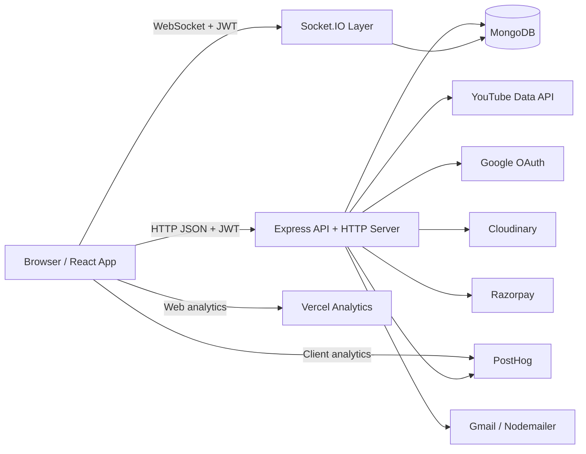

# PrepTube

PrepTube turns a YouTube playlist into a collaborative study room. Users can import a playlist, invite collaborators, track progress, write private notes per video, build streaks, chat in real time, browse public rooms, and unlock larger groups with Pro access.

Status: current MVP

## Production Notes

For a production-focused review of scaling limits, free-tier dependencies, and operational risks, see [PRODUCTION_CONSTRAINTS.md](./PRODUCTION_CONSTRAINTS.md).

## What The App Currently Does

PrepTube currently supports:

- Google OAuth sign-in
- Email/password sign-up and login
- Password reset by email
- Profile editing with uploaded or generated avatars
- YouTube playlist import through the YouTube Data API
- Independent PrepTube room creation for each user's import, even when multiple users import the same YouTube playlist
- Private and public playlist visibility
- Topic tagging for Explore discovery
- Invite-link joining through persistent tokens
- Public Explore feed with topic filters
- Video completion tracking per user
- Course-library playlist cards that show the requester's completion percentage
- Private per-video notes per user
- Per-playlist streak tracking based on study time
- Real-time room chat with text, image, and voice messages
- Premium upgrades through Razorpay orders, verification, and webhook reconciliation
- Limited-time free Pro claim flow
- Owner-managed collaborators, visibility, invite regeneration, and room deletion
- Admin analytics dashboard
- Landing-page feedback submission
- Public question submission endpoint for owner contact
- Account deletion with cleanup of owned content and user-linked room state

## Product Rules

- Each import creates its own PrepTube room document.
- `playlistId` is the PrepTube room id used in routes, invite flows, and Socket.IO room joins.
- `youtubePlaylistId` stores the original YouTube playlist source id and can be shared by many independent PrepTube rooms.
- Free rooms allow up to `6` total people including the owner.
- If the owner has active premium access, future joins are not blocked by the free member cap.
- If premium expires, existing members keep access; the cap only affects future joins.
- Public playlists appear in Explore, but normal users still join before entering the workspace.
- Admins can open public rooms directly for moderation and analytics workflows.
- Video notes are private to the author even inside shared rooms.
- Streaks are tracked per user, per playlist, using the `Asia/Kolkata` timezone.
- A streak day counts when the user logs at least `30` minutes in that playlist on that date.
- Importing a playlist that is already public in Explore by another user still succeeds and returns a friendly warning instead of blocking the import.

## Tech Stack

### Frontend

- React 19
- Vite
- React Router
- Tailwind CSS 4
- Axios
- Socket.IO client
- Recharts
- Motion
- `browser-image-compression`
- PostHog browser SDK
- Vercel Analytics
- Razorpay Checkout script

### Backend

- Node.js
- Express 5
- MongoDB
- Mongoose
- Passport Google OAuth 2.0
- JWT authentication
- Socket.IO
- Axios
- Razorpay SDK
- Nodemailer
- PostHog Node SDK
- Multer
- `express-rate-limit`
- Cloudinary upload API

## High-Level Architecture



## Runtime Structure

### Frontend runtime

- `frontend/src/main.jsx` bootstraps React, injects Vercel Analytics, and initializes PostHog if env vars are present.
- `frontend/src/App.jsx` lazy-loads the major route screens and mounts a shared footer.
- Authentication state is stored in `localStorage` as `token` and `user`.
- Protected screens redirect unauthenticated users to `/login?redirect=...`.
- The workspace page opens a Socket.IO connection after loading playlist details and recent chat history.
- The app uses route-level pages for data fetching and orchestration, with shared UI under `frontend/src/components`.

### Backend runtime

- `backend/server.js` loads env vars, connects MongoDB, configures CORS, compression, JSON parsing, and rate limiting, then mounts REST routes.
- The HTTP server is shared with Socket.IO.
- Global API rate limiting is applied on `/api`, excluding the Razorpay webhook path.
- `protect` middleware verifies JWTs and normalizes user state such as username, avatar, and expired premium flags.
- `adminOnly` protects admin-only routes.
- `planMiddleware` blocks joins when a free room is already full.
- Controllers own business logic, persistence, third-party API calls, and normalization.
- Playlist controllers treat room identity and source identity separately: room lookups use `playlistId`, while duplicate-import checks and public-source warnings use `youtubePlaylistId`.

## Core Data Flow

### 1. Authentication flow

#### Google OAuth

```text
User clicks Continue with Google
-> browser navigates to /api/auth/google?redirect=...
-> Passport starts Google OAuth
-> backend finds or creates user
-> backend updates lastLoginAt and avatar/username defaults if needed
-> backend signs JWT
-> backend redirects to /auth/callback?token=...&redirect=...&isNewUser=...
-> frontend fetches /api/users/me with that token
-> frontend stores token + user in localStorage
-> frontend redirects to the requested route
```

#### Email/password auth

```text
User registers or logs in
-> frontend POSTs /api/users/register or /api/users/login
-> backend validates input and credentials
-> backend returns serialized user + JWT
-> frontend stores auth in localStorage
-> protected screens send the Bearer token on later requests
```

Important auth notes:

- Manual registration only allows `gmail.com` or `googlemail.com` addresses.
- Google sign-in can attach to an existing email user.
- Missing usernames and avatars are auto-generated on auth middleware or OAuth/login flows.
- Login and registration endpoints are rate-limited.

### 2. Playlist import flow

```text
User pastes a YouTube playlist URL on /courses
-> frontend POST /api/playlists/create
-> backend extracts the YouTube list id
-> backend checks whether this owner already imported that source playlist
-> backend checks whether another user's public room already exposes that source playlist in Explore
-> backend fetches playlist metadata from YouTube
-> backend fetches playlist items, paginated
-> backend fetches video durations in batches
-> backend stores normalized videos in MongoDB
-> backend generates a unique PrepTube room id
-> backend creates a persistent invite token
-> backend optionally returns PLAYLIST_ALREADY_PUBLIC warning metadata
-> frontend refreshes the course library
```

Imported playlist documents store:

- PrepTube room id
- source YouTube playlist id
- room ownership and collaborators
- visibility and topics
- normalized video metadata
- per-user progress
- per-user private notes
- invite token

### 3. Explore and public visibility flow

```text
Owner edits topics and makes playlist public
-> frontend PATCH /api/playlists/:playlistId/visibility
-> backend requires owner access
-> backend normalizes topics
-> backend rejects public visibility if no topics are selected
-> playlist appears in /api/playlists/explore
-> frontend Explore screen filters public rooms by topic chips
```

Important visibility note:

- Explore lists public PrepTube rooms, not unique YouTube source playlists. Different users can publish their own room copies of the same underlying YouTube playlist.

### 4. Invite and join flow

```text
Owner generates invite link
-> frontend POST /api/playlists/:playlistId/invite
-> backend returns /join/:token link

User joins through token, invite URL, or Explore
-> frontend POST /api/playlists/join
-> middleware resolves invite token or public playlist id
-> middleware enforces member limit unless owner has active premium
-> backend adds user to members[]
-> frontend redirects to /video/:playlistId
```

### 5. Workspace, progress, notes, and streak flow

```text
User opens /video/:playlistId
-> frontend GET /api/playlists/:playlistId/details
-> backend returns playlist metadata, videos, access info, stats, invite token for owner, and requester progress
-> frontend renders the shared workspace

User marks a video complete
-> frontend POST /api/playlists/mark or /unmark
-> backend updates progress[user].completedVideos
-> frontend refreshes playlist details

User writes a note
-> frontend PUT /api/playlists/:playlistId/videos/:videoId/note
-> backend stores or clears the note in playlist.videoNotes
-> note is returned only in the current user's playlist payload

User stays active in workspace
-> frontend accumulates active time locally
-> frontend POST /api/playlists/:playlistId/time every 5 minutes and on unload/visibility change
-> backend merges time into progress[user].dailyMinutes
-> backend recalculates streaks and badges
```

Library payload notes:

- `/api/playlists/my-playlists` returns room-scoped playlist cards for the current user.
- Each playlist card payload includes requester-specific completion data so the Courses screen can render the same progress state shown inside the workspace.

### 6. Chat and media flow

```text
Workspace loads
-> frontend GET /api/playlists/:playlistId/chats for recent history
-> frontend opens Socket.IO with JWT in handshake auth
-> client emits joinRoom
-> socket server verifies playlist visibility/access

Text chat
-> client emits chatMessage
-> socket server validates access and payload
-> chat is stored in ChatMessage collection
-> server emits newMessage to the playlist room

Image or voice chat
-> frontend uploads file to /api/playlists/:playlistId/chat/upload
-> backend uploads media to Cloudinary
-> backend returns mediaUrl + messageType
-> frontend emits chatMessage with that mediaUrl
-> socket server persists and broadcasts message
```

### 7. Pricing and premium flow

#### Paid Razorpay flow

```text
User clicks a paid upgrade CTA
-> frontend POST /api/payment/create-order
-> backend creates a Razorpay order
-> backend stores the order in Payment collection
-> frontend opens Razorpay Checkout
-> Razorpay returns payment response to frontend
-> frontend POST /api/payment/verify
-> backend verifies HMAC signature
-> backend marks the Payment record as paid
-> backend upgrades the user and extends premiumExpiresAt
-> frontend stores the updated user
-> frontend keeps the last payment summary in sessionStorage
```

#### Free Pro promo flow

```text
User clicks Unlock Pro Free on /pricing
-> frontend POST /api/payment/claim-free-pro
-> backend applies a one-time promo upgrade keyed by a synthetic order id
-> backend updates the user's premium plan and premiumExpiresAt
-> frontend updates stored user state and redirects to /courses
```

#### Webhook reconciliation

```text
Razorpay sends payment.captured webhook
-> backend verifies webhook signature
-> backend looks up Payment by orderId
-> backend marks it as paid if not already processed
-> backend upgrades the user idempotently
```

### 8. Feedback and owner-contact flow

```text
User submits landing-page feedback
-> frontend POST /api/auth/feedback
-> backend validates input
-> backend sends an email to the owner inbox

User submits a question
-> frontend or external client POST /api/auth/question
-> backend validates input
-> backend sends the message to the owner inbox
```

### 9. Admin analytics flow

```text
Admin opens /admin/analytics
-> frontend GET /api/admin/analytics with JWT
-> backend verifies admin role
-> backend aggregates users, premium counts, playlists, signups, login timing, and recent purchases
-> frontend renders charts and summary cards
```

## Data Model

### `User`

Stored in `backend/models/User.js`.

Key fields:

- `name`
- `email`
- `username`
- `password`
- `googleId`
- `avatar`
- `avatarSource`
- `role`
- `isPremium`
- `plan`
- `premiumExpiresAt`
- `processedPaymentOrderIds`
- `lastLoginAt`
- `playlists[]`
- `passwordResetToken`
- `passwordResetExpires`
- `createdAt`
- `updatedAt`

Behavioral notes:

- Passwords are hashed with `bcryptjs` on save.
- Premium is treated as active only if the premium flag exists and `premiumExpiresAt` is still in the future.
- Avatar defaults are generated if none is supplied.
- Processed payment order ids are used to make premium upgrades idempotent.

### `Playlist`

Stored in `backend/models/Playlist.js`.

Key fields:

- `playlistId`
- `youtubePlaylistId`
- `title`
- `owner`
- `members[]`
- `isPublic`
- `topics[]`
- `inviteToken`
- `videos[]`
- `videoNotes[]`
- `progress[]`
- `createdAt`
- `updatedAt`

Embedded structures:

- `videos[]`
  - `videoId`
  - `title`
  - `thumbnail`
  - `duration`
  - `durationSeconds`
- `videoNotes[]`
  - `videoId`
  - `user`
  - `content`
  - `updatedAt`
- `progress[]`
  - `user`
  - `completedVideos[]`
  - `currentStreak`
  - `longestStreak`
  - `lastStreakDate`
  - `earnedBadges[]`
  - `dailyMinutes[]`

Behavioral notes:

- Progress and notes are embedded inside the playlist document, not stored as separate collections.
- Playlist state is normalized in controller flows to dedupe notes, progress rows, and topics.
- `playlistId` is the unique PrepTube room identifier.
- `youtubePlaylistId` keeps the original YouTube source id for import dedupe checks, public-source warnings, and backward compatibility with legacy documents.
- Many playlist documents can now reference the same `youtubePlaylistId` while remaining fully independent rooms.

### `ChatMessage`

Stored in `backend/models/ChatMessage.js`.

Key fields:

- `playlist`
- `sender`
- `message`
- `messageType`
- `mediaUrl`
- `createdAt`
- `updatedAt`

Behavioral notes:

- Chat history is stored separately from playlist documents.
- `messageType` can be `text`, `image`, or `voice`.
- REST history fetch returns the latest `50` messages.

### `Payment`

Stored in `backend/models/Payment.js`.

Key fields:

- `orderId`
- `userId`
- `receipt`
- `planId`
- `planName`
- `amount`
- `currency`
- `paymentId`
- `signature`
- `status`
- `premiumExpiresAt`
- `verifiedAt`
- `lastVerificationAttemptAt`
- `createdAt`
- `updatedAt`

Behavioral notes:

- Payment rows persist order lifecycle state for Razorpay purchases.
- `paymentId` is unique and sparse.
- Status is one of `created`, `verification_failed`, or `paid`.
- The model supports idempotent verification and webhook reconciliation.

## API Surface

### Frontend routes

| Route | Purpose |
| --- | --- |
| `/` | Marketing landing page |
| `/courses` | Authenticated playlist library and import/join entry |
| `/explore` | Public playlist discovery |
| `/faqs` | FAQs page |
| `/pricing` | Free vs Pro page and promo claim flow |
| `/success` | Payment success summary |
| `/join/:token` | Invite-link join handler |
| `/login` | Email login + Google entry |
| `/register` | Email signup |
| `/video/:id` | Shared playlist workspace |
| `/profile` | Profile and account settings |
| `/auth/callback` | OAuth token bootstrap page |
| `/admin/analytics` | Internal admin dashboard |
| `/forgot-password` | Reset request form |
| `/reset-password/:token` | Password reset form |

### Backend routes

#### Auth: `/api/auth`

| Method | Path | Purpose |
| --- | --- | --- |
| `GET` | `/google` | Start Google OAuth |
| `GET` | `/google/callback` | Complete Google OAuth |
| `GET` | `/protected` | Example protected endpoint |
| `POST` | `/forgot-password` | Send reset email |
| `POST` | `/reset-password/:token` | Complete password reset |
| `POST` | `/feedback` | Submit product feedback |
| `POST` | `/question` | Submit a question to the owner |

#### Users: `/api/users`

| Method | Path | Purpose |
| --- | --- | --- |
| `POST` | `/register` | Email signup |
| `POST` | `/login` | Email login |
| `GET` | `/me` | Get current user |
| `PATCH` | `/profile` | Update username/avatar |
| `DELETE` | `/me` | Delete account |

#### Playlists: `/api/playlists`

| Method | Path | Purpose |
| --- | --- | --- |
| `GET` | `/explore` | Public playlists + topic options |
| `POST` | `/create` | Import YouTube playlist into a new room for the current user |
| `GET` | `/my-playlists` | Rooms owned by or joined by the user, including requester progress summaries |
| `POST` | `/mark` | Mark video complete |
| `POST` | `/unmark` | Unmark video |
| `POST` | `/join` | Join by invite token or public playlist id |
| `GET` | `/:playlistId/details` | Workspace payload |
| `PUT` | `/:playlistId/videos/:videoId/note` | Save or clear private note |
| `GET` | `/:playlistId/chats` | Recent chat history |
| `DELETE` | `/:playlistId/chats/:chatId` | Delete a public-room chat as an admin moderator |
| `POST` | `/:playlistId/invite` | Generate or regenerate invite token |
| `POST` | `/:playlistId/leave` | Leave room |
| `DELETE` | `/:playlistId/members/:userId` | Remove member |
| `PATCH` | `/:playlistId/visibility` | Update visibility and topics |
| `POST` | `/:playlistId/time` | Log active study time |
| `POST` | `/:playlistId/chat/upload` | Upload image or voice media |
| `DELETE` | `/:playlistId` | Delete playlist |

#### Payments: `/api/payment`

| Method | Path | Purpose |
| --- | --- | --- |
| `POST` | `/create-order` | Create Razorpay order |
| `POST` | `/claim-free-pro` | Claim the temporary free Pro promo |
| `POST` | `/verify` | Verify payment and activate premium |
| `POST` | `/webhook` | Receive Razorpay webhook events |

#### Admin: `/api/admin`

| Method | Path | Purpose |
| --- | --- | --- |
| `GET` | `/analytics` | Load internal analytics dashboard data |

## Project Structure

```text
PrepTube/
├─ backend/
│  ├─ config/
│  │  ├─ db.js
│  │  └─ passport.js
│  ├─ controllers/
│  │  ├─ adminController.js
│  │  ├─ paymentController.js
│  │  ├─ playlistController.js
│  │  └─ userController.js
│  ├─ middleware/
│  │  ├─ authMiddleware.js
│  │  └─ planMiddleware.js
│  ├─ models/
│  │  ├─ ChatMessage.js
│  │  ├─ Payment.js
│  │  ├─ Playlist.js
│  │  └─ User.js
│  ├─ routes/
│  │  ├─ adminRoutes.js
│  │  ├─ authRoutes.js
│  │  ├─ paymentRoutes.js
│  │  ├─ playlistRoutes.js
│  │  └─ userRoutes.js
│  ├─ socket/
│  │  └─ index.js
│  ├─ utils/
│  │  ├─ analytics.js
│  │  ├─ badgeUtils.js
│  │  ├─ emailService.js
│  │  ├─ playlistAccess.js
│  │  ├─ playlistTopics.js
│  │  └─ userIdentity.js
│  ├─ package.json
│  └─ server.js
├─ frontend/
│  ├─ src/
│  │  ├─ assets/
│  │  ├─ components/
│  │  │  ├─ ChatMessage.jsx
│  │  │  ├─ FeedbackPanel.jsx
│  │  │  ├─ Footer.jsx
│  │  │  ├─ ForgotPasswordPage.jsx
│  │  │  ├─ Loader.jsx
│  │  │  ├─ Navbar.jsx
│  │  │  ├─ ResetPasswordPage.jsx
│  │  │  ├─ ReviewCard.jsx
│  │  │  ├─ StreakBadge.jsx
│  │  │  └─ UpgradePromptBanner.jsx
│  │  ├─ data/
│  │  │  └─ faqs.js
│  │  ├─ pages/
│  │  │  ├─ AdminAnalyticsPage.jsx
│  │  │  ├─ AuthCallback.jsx
│  │  │  ├─ CoursesPage.jsx
│  │  │  ├─ ExplorePage.jsx
│  │  │  ├─ FAQsPage.jsx
│  │  │  ├─ Icons.jsx
│  │  │  ├─ JoinPage.jsx
│  │  │  ├─ LandingPage.jsx
│  │  │  ├─ LoginPage.jsx
│  │  │  ├─ PricingPage.jsx
│  │  │  ├─ ProfilePage.jsx
│  │  │  ├─ RegisterPage.jsx
│  │  │  ├─ SuccessPage.jsx
│  │  │  └─ VideoPage.jsx
│  │  ├─ utils/
│  │  │  ├─ auth.js
│  │  │  ├─ avatarUpload.js
│  │  │  ├─ meta.js
│  │  │  ├─ payment.js
│  │  │  ├─ playlistTopics.js
│  │  │  └─ promo.js
│  │  ├─ App.css
│  │  ├─ App.jsx
│  │  ├─ index.css
│  │  └─ main.jsx
│  ├─ index.html
│  ├─ package.json
│  ├─ tailwind.config.js
│  ├─ vercel.json
│  └─ vite.config.js
├─ index.html
├─ PRODUCTION_CONSTRAINTS.md
└─ README.md
```

## File Responsibilities

### Frontend pages

- `LandingPage.jsx`
  - product marketing
  - promo banner
  - demo video
  - review carousel
  - feedback section
- `CoursesPage.jsx`
  - private library view
  - playlist import
  - import warning banner for already-public source playlists
  - invite-token join
  - owned-room deletion
- `ExplorePage.jsx`
  - public room feed
  - topic filtering
  - join/open public rooms
- `JoinPage.jsx`
  - token-based join bootstrap flow
- `VideoPage.jsx`
  - workspace shell
  - selected video state
  - completion toggles
  - private notes
  - study-time tracking
  - streak badge toasts
  - live chat
  - invite management
  - topic and visibility management
  - member management
  - public-room moderation actions
- `PricingPage.jsx`
  - current Pro promo claim flow
  - plan comparison copy
- `SuccessPage.jsx`
  - latest payment summary
- `ProfilePage.jsx`
  - profile editing
  - avatar processing
  - logout
  - account deletion
- `AdminAnalyticsPage.jsx`
  - internal analytics dashboard
- `FAQsPage.jsx`
  - FAQ content rendering
- `AuthCallback.jsx`
  - OAuth bootstrap
- `LoginPage.jsx`, `RegisterPage.jsx`
  - auth forms

### Frontend utilities

- `auth.js`
  - token/user storage
  - auth headers
  - stored-user normalization
  - auth redirects
- `payment.js`
  - create order
  - open Razorpay Checkout
  - verify payment
  - cache latest payment summary in `sessionStorage`
- `promo.js`
  - current free-Pro promo copy
- `avatarUpload.js`
  - client-side image preparation for avatars
- `meta.js`
  - document title and meta tag helpers
- `playlistTopics.js`
  - topic normalization and UI helpers

### Backend controllers

- `userController.js`
  - register user
  - login user
  - get current user
  - update profile
  - delete account
  - forgot/reset password
  - submit feedback
  - submit question
- `playlistController.js`
  - create/import playlist
  - room id generation and YouTube-source import checks
  - list user playlists
  - list public Explore playlists
  - mark/unmark videos
  - get playlist details
  - save notes
  - generate invite token
  - join/leave rooms
  - remove members
  - update visibility/topics
  - log study time
  - upload media
  - delete playlist
  - delete chat message
  - get recent chats
- `paymentController.js`
  - create Razorpay order
  - claim free Pro promo
  - verify payments
  - handle Razorpay webhook
- `adminController.js`
  - aggregate admin analytics

### Backend utilities and middleware

- `authMiddleware.js`
  - JWT auth
  - auto-normalize username/avatar
  - auto-expire outdated premium flags
  - admin guard
- `planMiddleware.js`
  - enforce free-plan member caps before joins
- `playlistAccess.js`
  - owner/member/access checks
- `playlistTopics.js`
  - topic normalization and topic option building
- `badgeUtils.js`
  - streak badge tiers and badge awarding helpers
- `userIdentity.js`
  - serialized user output
  - username generation
  - avatar helpers
  - timezone date helpers
  - premium activity checks
- `analytics.js`
  - PostHog event capture and shutdown
- `emailService.js`
  - welcome email
  - password reset email
  - owner feedback/question emails

## Environment Variables

### Backend `.env`

```env
PORT=5000
MONGO_URI=your_mongodb_connection_string
JWT_SECRET=your_jwt_secret

FRONTEND_URL=http://localhost:5173
CLIENT_URL=http://localhost:5173

GOOGLE_CLIENT_ID=your_google_client_id
GOOGLE_CLIENT_SECRET=your_google_client_secret
GOOGLE_CALLBACK_URL=http://localhost:5000/api/auth/google/callback

YOUTUBE_API_KEY=your_youtube_data_api_key

CLOUDINARY_CLOUD_NAME=your_cloudinary_cloud_name
CLOUDINARY_API_KEY=your_cloudinary_api_key
CLOUDINARY_API_SECRET=your_cloudinary_api_secret

RAZORPAY_KEY_ID=your_razorpay_key_id
RAZORPAY_KEY_SECRET=your_razorpay_key_secret
RAZORPAY_WEBHOOK_SECRET=your_razorpay_webhook_secret

EMAIL_USER=your_gmail_address
EMAIL_PASS=your_gmail_app_password
OWNER_EMAIL=optional_owner_inbox_for_feedback_and_questions

POSTHOG_KEY=optional_server_side_posthog_key
POSTHOG_HOST=https://app.posthog.com
```

Notes:

- `FRONTEND_URL` can be comma-separated for multiple allowed origins.
- The first `FRONTEND_URL` value is used for OAuth completion and invite-link generation.
- `CLIENT_URL` is used in password reset emails.
- `OWNER_EMAIL` falls back to `EMAIL_USER` if omitted.
- PostHog env vars are optional; analytics calls no-op when they are missing.

### Frontend `.env`

```env
VITE_API_URL=http://localhost:5000/api
VITE_SOCKET_URL=http://localhost:5000
VITE_POSTHOG_KEY=optional_browser_posthog_key
VITE_POSTHOG_HOST=https://app.posthog.com
```

## Local Development

### 1. Install dependencies

```bash
cd backend
npm install

cd ../frontend
npm install
```

### 2. Start the backend

```bash
cd backend
npm run dev
```

### 3. Start the frontend

```bash
cd frontend
npm run dev
```

### 4. Open the app

```text
Frontend: http://localhost:5173
Backend:  http://localhost:5000
```

## Deployment Notes

- Frontend is prepared for Vercel with `frontend/vercel.json`.
- Backend expects a single Node deployment serving both Express and Socket.IO.
- CORS for REST and Socket.IO is driven by `FRONTEND_URL`.
- Google OAuth callback URLs must exactly match the deployed backend route.
- The frontend must load the Razorpay checkout script in production just like local development.
- Cloudinary must be configured in production if image and voice chat are enabled.
- PostHog can be enabled independently on client and server.
- Root `index.html` is a standalone static file and is not the Vite app entry. The React app entry HTML is `frontend/index.html`.

## Current Architectural Constraints And Caveats

- Playlist imports are synchronous and happen inside the request cycle.
- Playlist progress, notes, streak history, members, and videos all live inside one playlist document.
- Socket.IO room state is process-local, so horizontal scaling would need a shared adapter such as Redis.
- Explore has topic filtering but no search, ranking, or pagination yet.
- Explore is room-based, so multiple public rooms can represent the same YouTube source playlist.
- Chat history REST fetch returns only the latest `50` messages.
- Voice and image uploads still flow through the backend before Cloudinary.
- Imported YouTube metadata is persisted in MongoDB, but the app does not yet implement a periodic YouTube refresh/resync workflow. This matters for freshness and policy compliance.
- The app currently assumes a valid YouTube playlist URL with a `list` query parameter.

## Suggested Next Improvements

1. Add playlist refresh/sync jobs so YouTube-derived metadata does not drift indefinitely.
2. Move playlist import to a background job queue for better reliability on large playlists.
3. Add Explore search, pagination, and ranking.
4. Split hot write paths such as progress and notes out of the playlist document as usage grows.
5. Add automated tests around joins, member limits, streak calculation, payments, and socket chat.
6. Add durable media metadata cleanup and stronger moderation tooling for public rooms.
